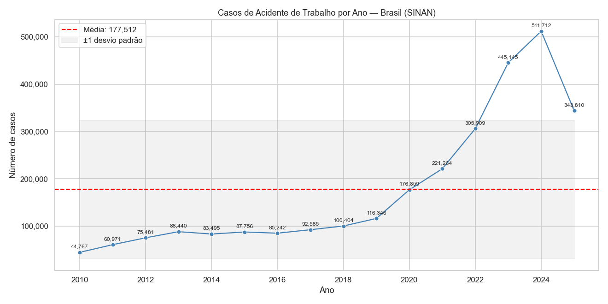
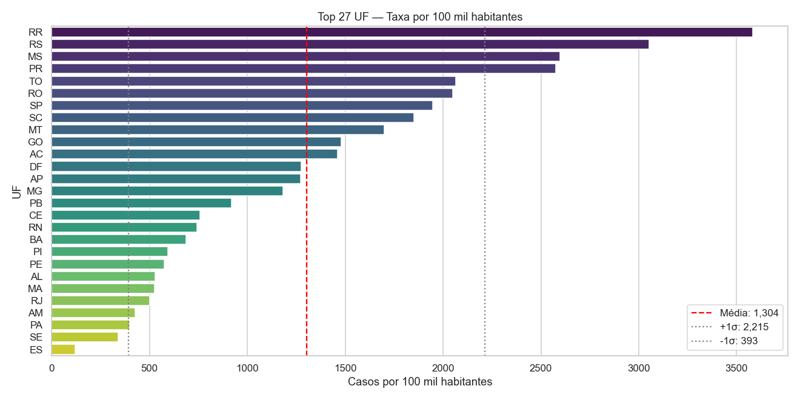
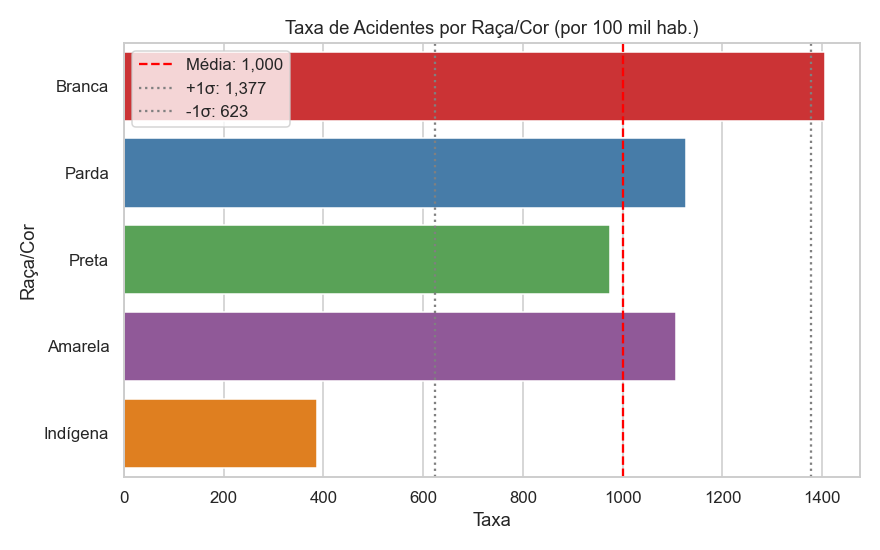

# Análise Epidemiológica de Agravos Relacionados ao Trabalho — SINAN/DATASUS

> Iniciação Científica vinculada ao **PET-Saúde I&SD — Grupo Tutorial de Saúde do Trabalhador**  
> Faculdade de Medicina de Botucatu (FMB) · Parcerias: Ministério da Saúde (MS), Ministério da Educação (MEC) e Ministério do Trabalho e Emprego (MTE)

---

## Contexto

Este projeto é uma Iniciação Científica derivada do projeto **PET-Saúde Interprofissionalidade & Saúde Digital (I&SD)**, mais especificamente do grupo tutorial sobre **Saúde do Trabalhador**. O grupo busca:

- Estudar os agravos relacionados ao trabalho, suas implicações, origens e relação com o trabalhador;
- Compreender os fatores que contribuem para a **subnotificação** de agravos ocupacionais;
- Conscientizar trabalhadores e profissionais de saúde sobre a **importância da notificação** ao SINAN.

O **Sistema de Informação de Agravos de Notificação (SINAN)**, gerido pelo Ministério da Saúde e disponibilizado pelo DATASUS, é a principal fonte de dados sobre agravos de notificação compulsória no Brasil — incluindo os agravos relacionados ao trabalho.

---

## Objetivo

Facilitar o acesso e a análise dos dados públicos do SINAN ao:

1. **Disponibilizar os dados já convertidos** de `.dbc` (formato proprietário do DATASUS) para `.csv`, cobrindo o período de **2010 a 2025**;
2. **Realizar análise epidemiológica aprofundada**, com normalização populacional (via IBGE) e geração automatizada de visualizações;
3. Produzir **conclusões relevantes para autoridades públicas** sobre subnotificação, perfil dos trabalhadores acometidos e desigualdades regionais, raciais e socioeconômicas associadas.

---

## Agravos Relacionados ao Trabalho

O projeto cobre os seguintes tipos de agravos, todos disponíveis no SINAN:

| Agravo | Descrição resumida |
|---|---|
| Acidente de Trabalho | Acidentes típicos, de trajeto e doenças do trabalho |
| Acidente de Trabalho com Material Biológico | Exposição a sangue, fluidos e outros materiais biológicos |
| Câncer Relacionado ao Trabalho | Neoplasias com nexo causal ocupacional |
| Dermatoses Relacionadas ao Trabalho | Doenças de pele de origem ocupacional |
| LER/DORT | Lesões por Esforço Repetitivo / Distúrbios Osteomusculares Relacionados ao Trabalho |
| Perda Auditiva Relacionada ao Trabalho | PAIR — perda auditiva induzida por ruído |
| Pneumoconioses Relacionadas ao Trabalho | Doenças pulmonares por inalação de poeiras minerais |
| Transtornos Mentais Relacionados ao Trabalho | Adoecimento psíquico com nexo ocupacional |

---

## Fontes de Dados

| Fonte | Uso |
|---|---|
| **SINAN / DATASUS** | Registros de notificação de agravos (2010–2025) |
| **IBGE** | Dados populacionais para normalização (por 100 mil habitantes) |
| **PNAD** | Proporções populacionais por escolaridade e raça/cor |

Os arquivos `.csv` já convertidos estão disponíveis para download no Google Drive, organizados por tipo de agravo:

> **[Download dos dados — Google Drive](https://drive.google.com/drive/folders/1uSXgGZntx0mKnouR8Ui74a70G_VeKAAX?usp=sharing)**

Após o download, coloque os arquivos dentro do diretório `csvs/`, mantendo a estrutura de subpastas por agravo.

---

## Visualizações (Exemplos) — Acidente de Trabalho

A seguir, exemplos de gráficos gerados pelo script para o agravo **Acidente de Trabalho**:

### Evolução temporal das notificações (2010–2025)



O número de notificações cresceu de forma expressiva ao longo da série histórica, passando de **44.767 casos em 2010** para um pico de **511.712 casos em 2024**. Esse aumento pode refletir tanto a expansão real dos acidentes quanto a melhoria gradual da cobertura e da cultura de notificação no país. O dado de 2025 (~343 mil) é parcial.

---

### Taxa de acidentes por Unidade Federativa (por 100 mil habitantes)



A normalização pela população revela desigualdades regionais marcantes. **Roraima (RR)** apresenta a maior taxa (~3.600/100 mil), seguido por **Rio Grande do Sul (RS)**, **Mato Grosso do Sul (MS)** e **Paraná (PR)**. Estados do Nordeste e Norte apresentam taxas significativamente menores, o que pode estar relacionado à subnotificação, à informalidade do trabalho ou a perfis distintos de atividade econômica.

---

### Taxa de acidentes por Raça/Cor (por 100 mil habitantes)



A distribuição normalizada por raça/cor mostra que trabalhadores **brancos** apresentam a maior taxa de notificação (~1.400/100 mil), seguidos por **pardos** e **amarelos** (~1.100/100 mil). A taxa da população **indígena** é a mais baixa (~380/100 mil), o que provavelmente reflete subnotificação acentuada nesse grupo, dada sua menor inserção no mercado formal e o acesso mais restrito aos serviços de saúde.

---

## Análises disponíveis (Acidente de Trabalho)

O script `view.py` oferece um menu interativo com as seguintes opções:

| Opção | Análise |
|---|---|
| `1` | Série temporal — casos por ano |
| `2` | Casos por UF (normalizado por 100 mil hab.) |
| `3` | Casos por sexo e ano (empilhado) |
| `4` | Casos por faixa etária (normalizado) |
| `5` | Casos por raça/cor (normalizado) |
| `6` | Casos por escolaridade (normalizado) |
| `7` | Desfecho dos casos (gráfico de pizza) |
| `8` | Tipo de acidente por ano |
| `9` | Top 20 CIDs de lesão |
| `h` | Heatmap UF × Ano |
| `r` | Resumo estatístico no terminal |
| `q` | Sair |

---

## Estrutura do repositório

```
IC-analise-dados-SINAN/
├── csvs/
│   ├── acidente_de_trabalho/       # CSVs convertidos do SINAN (2010–2025)
│   ├── acidente_mat_biologico/
│   ├── cancer_trabalho/
│   ├── dermatoses_trabalho/
│   ├── ler_dort_trabalho/
│   ├── perda_auditiva_trabalho/
│   ├── pneumoconioses_trabalho/
│   └── transt_mentais_trabalho/
├── plots/
│   └── acidente_de_trabalho/       # Gráficos gerados
├── view.py                         # Script principal de análise
└── README.md
```

---

## Próximos passos

- [ ] Análise cruzada de variáveis (ex.: raça × escolaridade, faixa etária × UF)
- [ ] Suporte a todos os tipos de agravos no script de análise
- [ ] Melhoria da interface de interação com o usuário

---

## Como rodar o projeto

### 1. Pré-requisitos

Certifique-se de ter o **Python 3.9+** instalado. Para verificar:

```bash
python --version
```

### 2. Instale as dependências

```bash
pip install pandas matplotlib seaborn
```

### 3. Clone o repositório (ou baixe os arquivos)

```bash
git clone https://github.com/seu-usuario/IC-analise-dados-SINAN.git
cd IC-analise-dados-SINAN
```

### 4. Baixe os dados

Os CSVs não estão no repositório por conta do tamanho dos arquivos. Faça o download pelo Google Drive:

> **[Download dos dados — Google Drive](https://drive.google.com/drive/folders/1uSXgGZntx0mKnouR8Ui74a70G_VeKAAX?usp=sharing)**

Após o download, coloque os arquivos dentro de `csvs/`, mantendo a estrutura de subpastas (ex.: `csvs/acidente_de_trabalho/ACGRBR24.csv`).

### 5. Execute o script

```bash
python view.py
```

O script carrega automaticamente todos os CSVs disponíveis em `csvs/acidente_de_trabalho/` e exibe o menu interativo no terminal.

### 5. Escolha uma análise

```
Carregando dados do SINAN — Acidente de Trabalho...
  2.832.457 registros carregados de 2010–2025.

──────── MENU ────────────────────────────────
  [1] Série temporal (casos por ano)
  [2] Casos por UF
  ...
  [q] Sair
──────────────────────────────────────────────
Opção:
```

Digite o número ou letra correspondente à análise desejada e pressione **Enter**. O gráfico será exibido em uma janela interativa.

---

## Licença

Os dados originais são públicos e disponibilizados pelo **DATASUS/Ministério da Saúde** e pelo **IBGE**. O código deste repositório está sob a licença [MIT](https://opensource.org/licenses/MIT).
